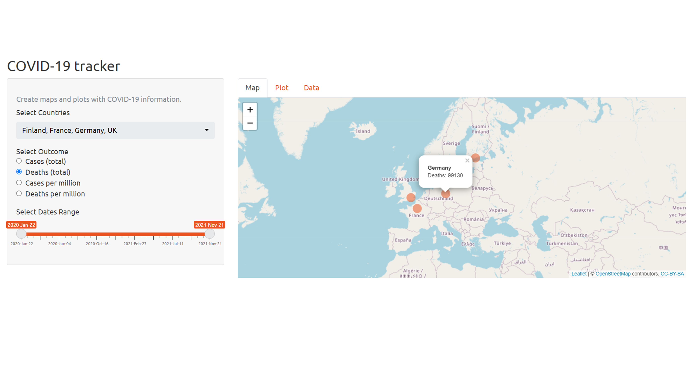

## About the project {.smaller}
This presentation is part of the Course Project for the Coursera Developing Data Products class. The peer assessed assignment has two parts. First, we need to create a Shiny application and deploy it on Rstudio's servers. Second, we should use Slidify or Rstudio Presenter to prepare a reproducible pitch presentation about the application. This presentation adresses the second part of the course project.

I constructed a shiny app for the tracking of COVID-19 cases and deaths by country.

The app can be found at:

https://sandalk57.shinyapps.io/COVID-19_tracker_app/

Source code for ui.R and server.R files are available on the GitHub:
https://github.com/sandalk57/Data-products-shiny-app.git

## COVID-19 Tracker App 

This app helps track COVID-19 cases and deaths by country, using the dataset provided by the
<a href="https://github.com/CSSEGISandData/COVID-19/tree/master/csse_covid_19_data/csse_covid_19_time_series">Johns Hopkins Center for Systems Science and Engineering.</a>

First, you can select the countries you want to see the data from. Then you can choose if you want to see the number of cases, deaths, cases per million or deaths per million. Finally, you can select the dates range.

The app will then show on a map the total number for all chosen countries on one tab and show the cumulative numbers on a plot on a second tab. The last tab shows the data source. 

## Server calculation - Map 

```{r echo = F, warning=FALSE}
library(shiny); library(leaflet)
```

```{r, size = 'tiny'}
shinyServer(
      function(input, output){
            # get input values
            selected_outcome <- reactive({
                  ifelse(input$outval == '1', 'cumulative_cases', ifelse(input$outval == '2', 'cumulative_deaths', ifelse(input$outval == '3', 'cumulative_cases_per_million',
                                                                                                                          ifelse(input$outval == '4','cumulative_deaths_per_million',''))))
            })
            outcome <- reactive({
                  ifelse(input$outval == '1', 'Cases:', ifelse(input$outval == '2', 'Deaths:', ifelse(input$outval == '3', 'Cases per million:', ifelse(input$outval == '4','Deaths per million:',''))))
            })
            
            inputcountry <- reactive({ input$countryval })
            
            inputdates <- reactive({ input$dateval })
            
            # set output leaflet map
            output$mymap <- renderLeaflet({ leaflet() %>% addTiles() })
            
            observe({
                  # filter data for map
                  df <- reactive({mydata %>%
                              dplyr::filter(country %in% inputcountry()[1:length(inputcountry())],
                                            as.Date(date) >= inputdates()[1], as.Date(date) <= inputdates()[2]) %>%
                              select("country", selected_outcome(), 'lat', 'lng') %>%
                              `colnames<-` (c('country', 'myoutcome', 'lat', 'lng')) %>%
                              group_by(country) %>% filter(myoutcome == max(myoutcome)) %>%
                              mutate(content = paste("<p> <b>", country, "</b> </br>",
                                                     outcome(), myoutcome, "</p>"))
                  })
                  
                  # Create map
                  mymap <- leafletProxy("mymap")
                  mymap %>% clearMarkers()
                  leafletProxy("mymap", data = df()) %>%
                        addCircleMarkers( radius = 10, color = '#E94F19',
                                          stroke = FALSE, fillOpacity = 0.5,
                                          popup = df()$content) 
            })
      })
```

## Resulting map example

{width=90% height=90%}
